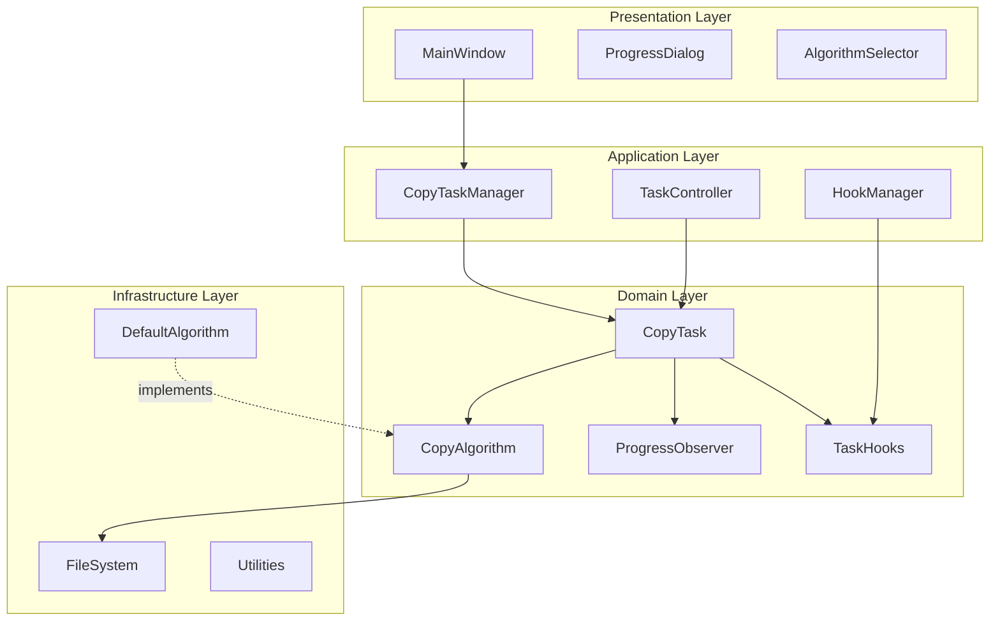
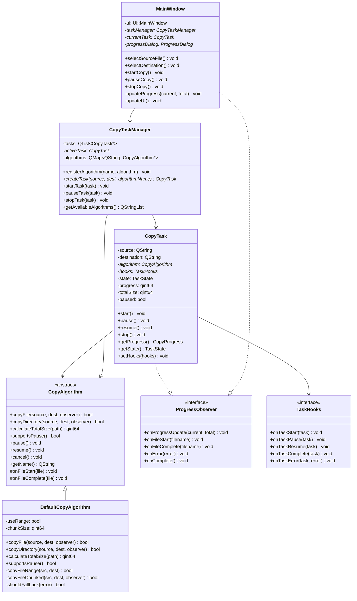
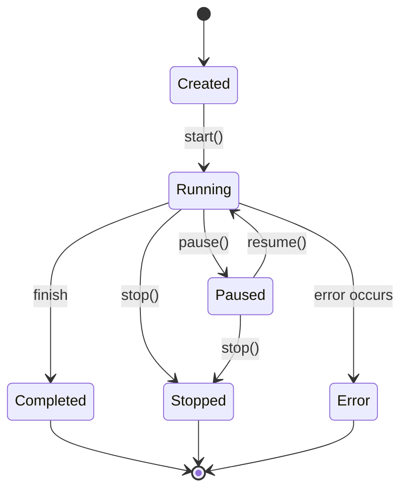
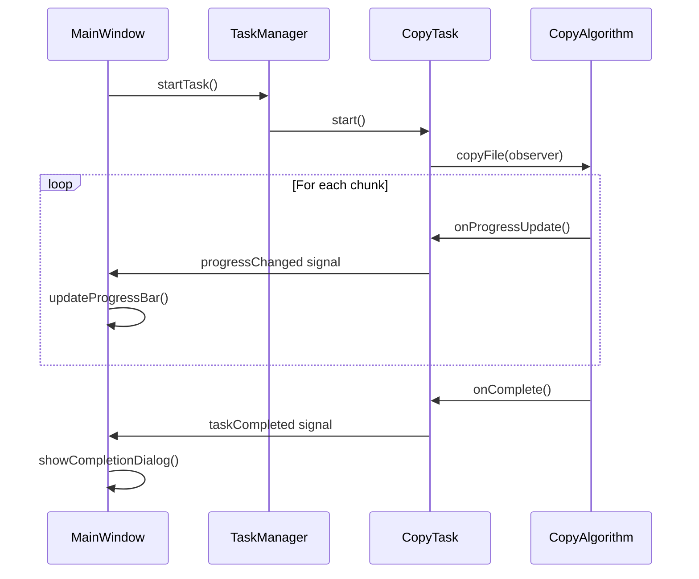
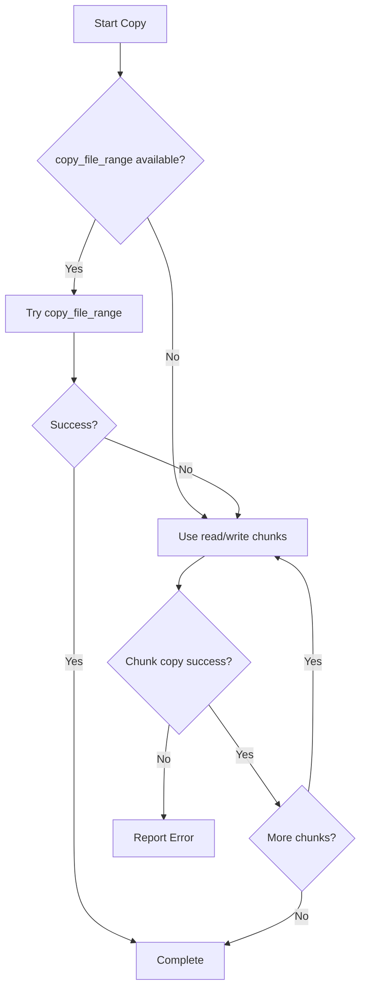

# File Copy Algorithm Validation Framework - Design Overview

## 1. Project Overview

This project is a Qt6-based demonstration application designed to validate and compare different file copying algorithms. The core goal is to create an extensible architecture that allows easy integration of custom copying algorithms while maintaining a clean, professional user interface similar to Windows File Explorer.

## 2. Functional Requirements

### 2.1 User Interface Requirements
- **File Selection**: QFileDialog integration for selecting source files/directories and target directories
- **Task Control**: Start, Pause, Stop buttons for copy operations
- **Progress Display**: Real-time percentage progress (copied bytes / total bytes)
- **Algorithm Selection**: Dropdown menu for choosing copy algorithms
- **Multi-source Support**: Handle both single files and entire directories

### 2.2 Algorithm Requirements
- **Default Algorithm**: Implement copy_file_range() with fallback to read/write (512KB chunks)
- **Extensibility**: Easy algorithm replacement without affecting core functionality
- **Performance Validation**: Framework should support performance comparison between algorithms

## 3. Architectural Design

### 3.1 Design Principles

Our architecture follows key software engineering principles:
- **SOLID**: Single Responsibility, Open/Closed, Liskov Substitution, Interface Segregation, Dependency Inversion
- **DRY**: Don't Repeat Yourself - shared components are reused
- **KISS**: Keep It Simple, Stupid - clean, understandable interfaces

### 3.2 Core Architecture Overview



### 3.3 Class Diagram



## 4. Component Design Details

### 4.1 Copy Algorithm Interface

The `CopyAlgorithm` abstract base class provides the core interface for all copy implementations:

```cpp
class CopyAlgorithm : public QObject {
public:
    virtual bool copyFile(const QString& source, const QString& dest, 
                         ProgressObserver* observer = nullptr) = 0;
    virtual bool copyDirectory(const QString& source, const QString& dest,
                              ProgressObserver* observer = nullptr) = 0;
    virtual qint64 calculateTotalSize(const QString& path) = 0;
    virtual bool supportsPause() const = 0;
    virtual QString getName() const = 0;
    
    // Control methods
    virtual void pause() {}
    virtual void resume() {}
    virtual void cancel() {}
    
protected:
    virtual void onFileStart(const QString& file) {}
    virtual void onFileComplete(const QString& file) {}
};
```

### 4.2 Task Lifecycle Management



### 4.3 Hook System Design

The hook system allows developers to inject custom behavior at key points:

```cpp
class TaskHooks {
public:
    virtual void onTaskStart(CopyTask* task) {}
    virtual void onTaskPause(CopyTask* task) { /* Default: sync data */ }
    virtual void onTaskResume(CopyTask* task) {}
    virtual void onTaskComplete(CopyTask* task) { /* Default: sync data */ }
    virtual void onTaskError(CopyTask* task, const QString& error) {}
};
```

### 4.4 Progress Observation System



## 5. Default Algorithm Implementation

### 5.1 Algorithm Strategy

The default algorithm implements a two-tier approach:

1. **Primary**: Use `copy_file_range()` system call for efficient kernel-space copying
2. **Fallback**: Use traditional `read()`/`write()` with 512KB chunks

### 5.2 Error Handling Strategy



## 6. Extension Points

### 6.1 Adding Custom Algorithms

To add a new algorithm:

1. Inherit from `CopyAlgorithm`
2. Implement required virtual methods
3. Register with `CopyTaskManager`

```cpp
class MyCustomAlgorithm : public CopyAlgorithm {
public:
    bool copyFile(const QString& source, const QString& dest, 
                  ProgressObserver* observer) override {
        // Your custom implementation
    }
    // ... other methods
};

// Registration
taskManager->registerAlgorithm("My Algorithm", new MyCustomAlgorithm());
```

### 6.2 Custom Task Hooks

```cpp
class MyTaskHooks : public TaskHooks {
public:
    void onTaskPause(CopyTask* task) override {
        // Custom pause behavior - e.g., sync to disk
        sync();
        logEvent("Task paused: " + task->getSource());
    }
};

task->setHooks(new MyTaskHooks());
```

## 7. Technology Stack

- **Build System**: CMake 3.16+
- **Framework**: Qt 6.2+ (Widgets module)
- **Language**: C++17
- **Platform**: Linux (with potential Windows compatibility)
- **Dependencies**: Qt6Widgets, Qt6Core

## 8. Project Structure

```
copyfiles/
├── CMakeLists.txt
├── src/
│   ├── main.cpp
│   ├── ui/
│   │   ├── MainWindow.h/.cpp
│   │   ├── ProgressDialog.h/.cpp
│   │   └── MainWindow.ui
│   ├── core/
│   │   ├── CopyAlgorithm.h/.cpp
│   │   ├── CopyTask.h/.cpp
│   │   ├── CopyTaskManager.h/.cpp
│   │   └── ProgressObserver.h
│   ├── algorithms/
│   │   └── DefaultCopyAlgorithm.h/.cpp
│   └── hooks/
│       └── TaskHooks.h/.cpp
└── tests/
    └── algorithm_tests.cpp
```

## 9. Key Benefits of This Design

### 9.1 Extensibility
- **Algorithm Independence**: New algorithms can be added without modifying existing code
- **Hook System**: Custom behaviors can be injected at runtime
- **Observer Pattern**: Progress updates are decoupled from algorithm implementation

### 9.2 Maintainability
- **Clear Separation**: UI, business logic, and algorithms are distinct layers
- **Single Responsibility**: Each class has a focused purpose
- **Dependency Injection**: Components depend on abstractions, not concrete implementations

### 9.3 Testability
- **Mockable Interfaces**: All key components can be easily mocked for testing
- **Isolated Algorithm Testing**: Algorithms can be tested independently
- **Progress Verification**: Observer pattern enables progress tracking verification

### 9.4 Performance
- **Efficient Default**: copy_file_range() provides kernel-level optimization
- **Chunked Fallback**: Large files are handled efficiently with configurable chunk sizes
- **Pause/Resume**: Tasks can be controlled without data loss

This architecture provides a solid foundation for validating file copy algorithms while maintaining flexibility for future enhancements and customizations. 