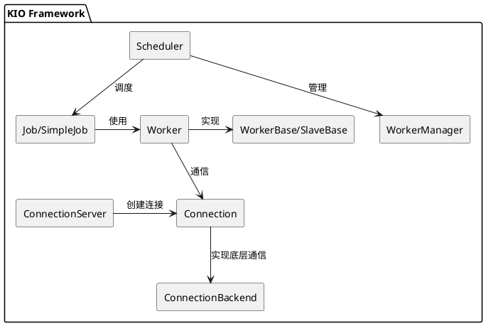
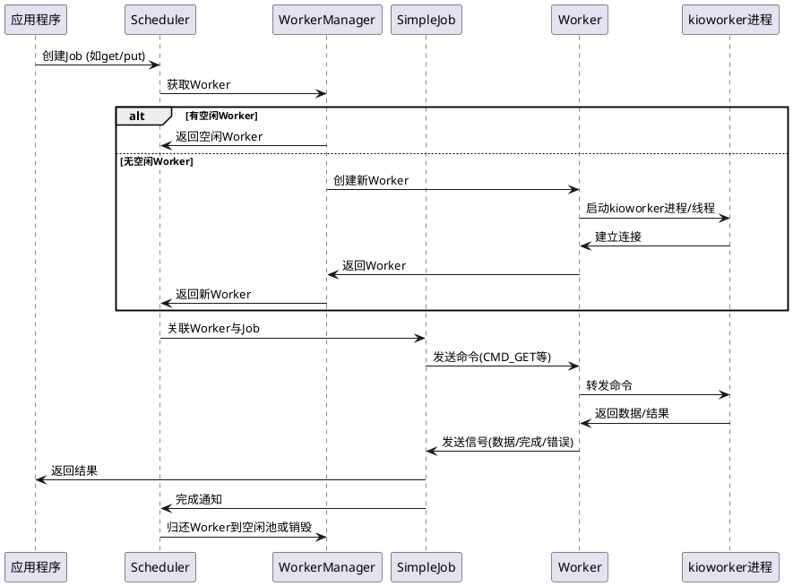
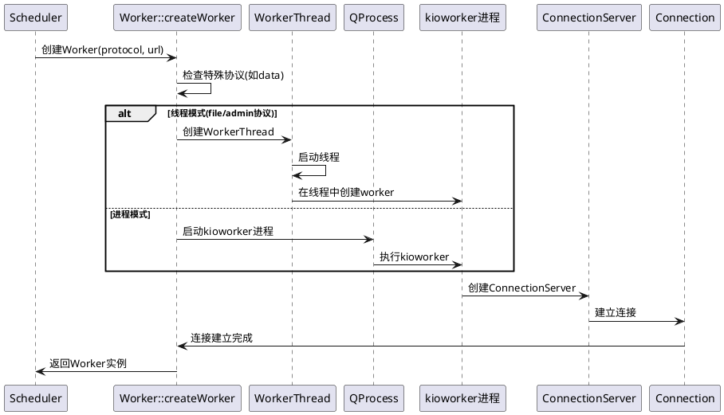
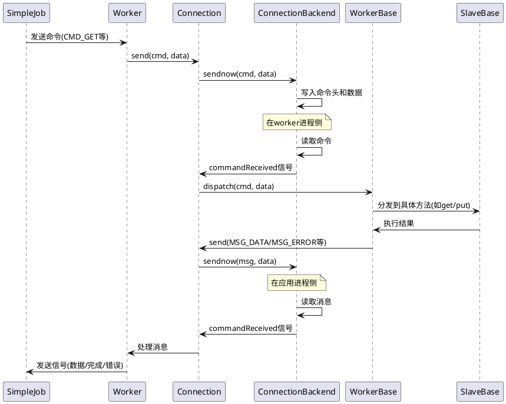
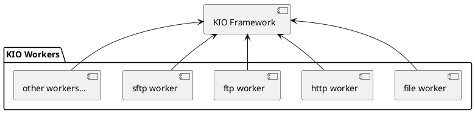
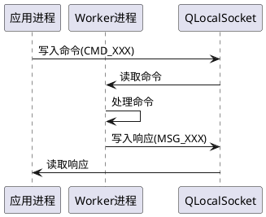

## 1. 框架概述

KIO Worker是KDE框架中的一个关键组件，负责处理各种I/O操作，特别是与不同协议(如file、http、ftp等)相关的文件操作。它采用了worker/job架构模式，使得I/O操作可以异步执行，同时保持应用程序的响应性。

## 2. 关键组件

### 2.1 核心组件

### 2.1 核心组件



- cheduler: 中央调度器，负责管理workers和jobs
- WorkerManager: 管理空闲workers的池
- SimpleJob: 表示一个I/O操作任务的基类
- Worker: 处理特定协议的工作进程
- WorkerBase/SlaveBase: worker实现的基类
- Connection: 在应用程序和worker之间的通信通道
- ConnectionServer: 创建连接的服务器
- ConnectionBackend: 连接的底层实现
## 3. 核心工作流程

### 3.1 总体流程


### 3.1 总体流程



### 3.2 Worker 创建流程




### 3.3 命令执行流程


## 关键设计亮点

### 4.1 模块化协议支持

KIO框架通过协议插件系统支持各种协议。每个协议对应一个worker实现，使得添加新协议变得简单：

### 4.2 通信机制

应用程序和worker之间通过本地socket通信，使用自定义二进制协议：


### 4.3 线程/进程处理模式

KIO框架同时支持线程模式和进程模式的worker：

- 进程模式：大多数worker使用此模式，增强了稳定性（一个worker崩溃不会导致应用程序崩溃）

- 线程模式：主要用于file协议，性能更好但稳定性稍差

## 5. 代码解析


### 5.1 Scheduler 如何分配 Worker

```cpp:src/core/scheduler.cpp
Worker *WorkerManager::takeWorkerForJob(SimpleJob *job)
{
    Worker *worker = schedulerPrivate()->heldWorkerForJob(job);
    if (worker) {
        return worker;
    }

    QUrl url = SimpleJobPrivate::get(job)->m_url;
    // TODO take port, username and password into account
    QMultiHash<QString, Worker *>::Iterator it = m_idleWorkers.find(url.host());
    if (it == m_idleWorkers.end()) {
        it = m_idleWorkers.begin();
    }
    if (it == m_idleWorkers.end()) {
        return nullptr;
    }
    worker = it.value();
    m_idleWorkers.erase(it);
    return worker;
}
```


这里的关键是：
- 首先检查是否有特定保留的worker
- 然后尝试寻找与URL主机匹配的空闲worker
- 如果找不到匹配的，使用任意空闲worker
- 如果没有空闲worker，返回null（上层会创建新worker）

### 5.2 Worker 创建

```cpp:src/core/worker.cpp
Worker *Worker::createWorker(const QString &protocol, const QUrl &url, int &error, QString &error_text)
{
    // 检查特殊协议
    if (protocol == QLatin1String("data")) {
        return new DataProtocol();
    }

    // 查找worker执行程序
    const QString _name = KProtocolInfo::exec(protocol);
    
    // 加载worker插件
    QPluginLoader loader(_name);
    
    // 决定使用线程模式还是进程模式
    if (protocol == QLatin1String("admin") || (bUseThreads && protocol == QLatin1String("file"))) {
        // 线程模式
        auto *factory = qobject_cast<WorkerFactory *>(loader.instance());
        if (factory) {
            auto *thread = new WorkerThread(worker, factory, workerAddress.toString().toLocal8Bit());
            thread->start();
            worker->setWorkerThread(thread);
            return worker;
        }
    }

    // 进程模式
    // 查找kioworker可执行文件
    QString kioworkerExecutable = QStandardPaths::findExecutable(QStringLiteral("kioworker"), searchPaths);
    
    // 启动进程
    process.setProgram(kioworkerExecutable);
    process.setArguments(args);
    process.startDetached(&pid);
    worker->setPID(pid);

    return worker;
}
```

这段代码展示了worker创建的两种方式：
- 线程模式：直接在线程中创建worker实例
- 进程模式：启动单独的kioworker进程


### 5.3 命令处理循环

```cpp:src/core/slavebase.cpp
void SlaveBase::dispatchLoop()
{
    while (!d->exit_loop) {
        // 等待接收命令
        if (d->appConnection.hasTaskAvailable() || d->appConnection.waitForIncomingTask(ms)) {
            // 读取命令
            int cmd;
            QByteArray data;
            ret = d->appConnection.read(&cmd, data);

            if (ret != -1) {
                // 分发命令处理
                if (d->inOpenLoop) {
                    dispatchOpenCommand(cmd, data);
                } else {
                    dispatch(cmd, data);
                }
            }
        }
        
        // 检查连接状态
        if (ret == -1) { // 连接断开
            if (!d->exit_loop && d->isConnectedToApp && !d->poolSocket.isEmpty()) {
                disconnectSlave();
                d->isConnectedToApp = false;
                closeConnection();
                d->updateTempAuthStatus();
                connectSlave(d->poolSocket);
            } else {
                break;
            }
        }

        // 检查是否被终止
        if (wasKilled()) {
            break;
        }
    }
}
```
这个循环是worker的核心处理逻辑：
- 等待并读取命令
- 分发命令到具体处理函数
- 处理连接断开和重连
- 检查终止信号

## 6. 总结

KIO Worker框架是一个设计精良的I/O处理系统，它通过以下机制实现了高效、稳定的文件操作：

- 分离的进程/线程模型：保证了应用程序稳定性和响应性
- 统一的协议接口：允许应用程序统一处理不同协议的文件操作
- 高效的调度系统：通过worker池和复用机制提高性能
- 灵活的通信机制：使用本地socket进行进程间通信
- 可扩展的协议支持：通过插件系统支持各种协议

这种设计使得KDE应用程序能够以统一的方式处理各种协议的资源，无论是本地文件还是远程资源，同时保持良好的性能和稳定性。