# DFM现代化Worker框架技术设计文档

## 1. 概述

本文档描述了DDE文件管理器新一代Worker框架（DFM-Worker）的技术设计。该框架借鉴了KIO Worker的概念，但通过采用现代C++技术和先进的架构设计，实现了更高效、更可靠、更安全的分布式文件操作处理系统。

### 1.1 设计背景

KIO Worker框架是一种成熟的技术方案，但其设计始于Qt3/Qt4时代，存在一些局限性：

- 进程间通信效率较低，尤其是大文件传输场景
- 资源管理不够高效，Worker进程占用较多系统资源
- 异步编程模型较为原始，不支持现代C++的异步特性
- 错误处理机制不够健壮，恢复策略有限
- 缺乏良好的内存安全保证和资源自动管理

### 1.2 设计目标

新框架的设计目标如下：

- **高性能**：利用共享内存、零拷贝等技术显著提升IPC效率
- **低资源占用**：优化Worker资源使用，降低内存与CPU占用
- **现代异步模型**：基于C++20协程和异步编程模型
- **更强的安全性**：采用RAII、智能指针等技术确保内存安全
- **松耦合架构**：模块化设计，组件间低耦合
- **简化开发**：降低Worker开发难度，提供更友好的API
- **自愈能力**：强大的错误处理和自动恢复机制
- **扩展性**：支持动态加载的插件系统

## 2. 架构设计

### 2.1 总体架构

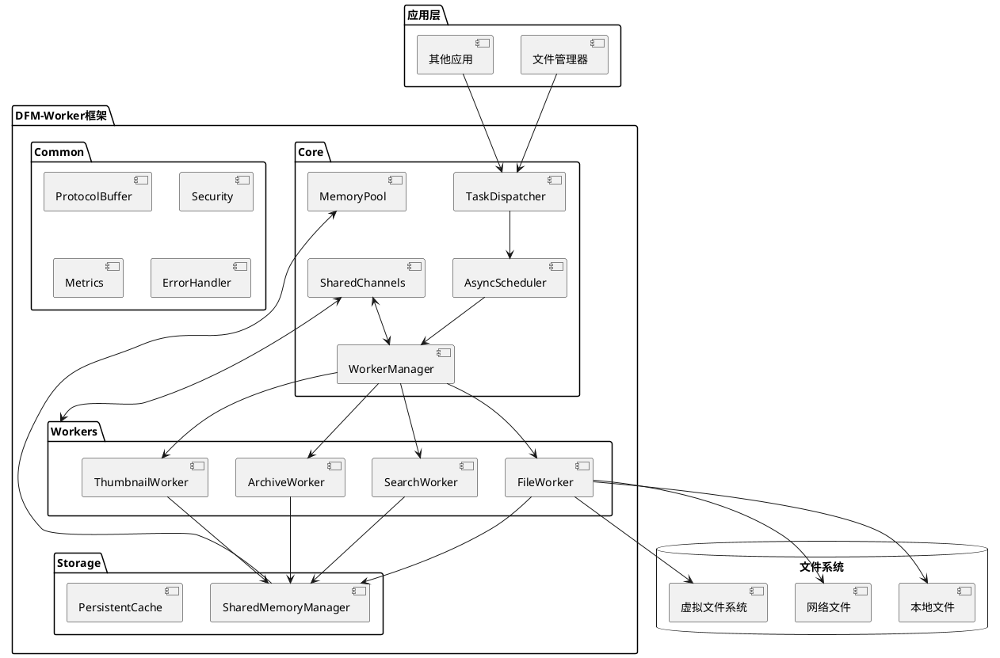

### 2.2 核心组件

#### 2.2.1 TaskDispatcher（任务分发器）

TaskDispatcher负责接收来自应用程序的任务请求，并将其转换为内部任务格式，然后交给AsyncScheduler处理。

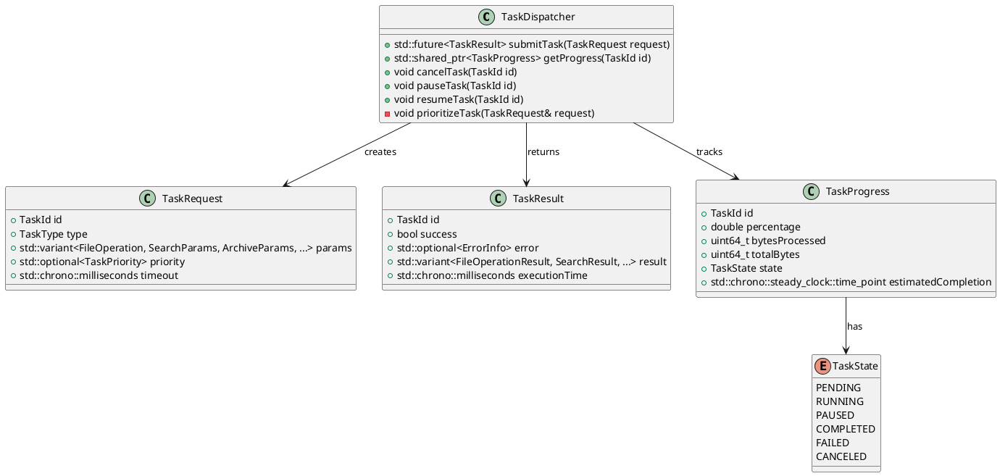

#### 2.2.2 AsyncScheduler（异步调度器）

AsyncScheduler使用C++20协程技术实现高效的任务调度和执行。它能够根据系统负载、任务优先级等因素动态调整执行策略。

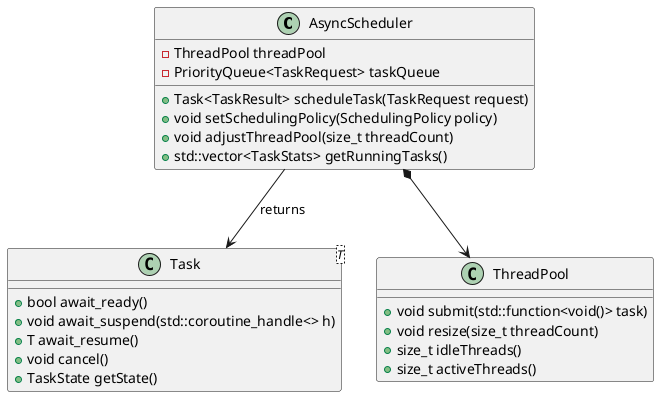

#### 2.2.3 WorkerManager（Worker管理器）

WorkerManager负责Worker的生命周期管理，包括创建、复用、监控和销毁Worker进程。它实现了比KIO Worker更高效的进程池机制。

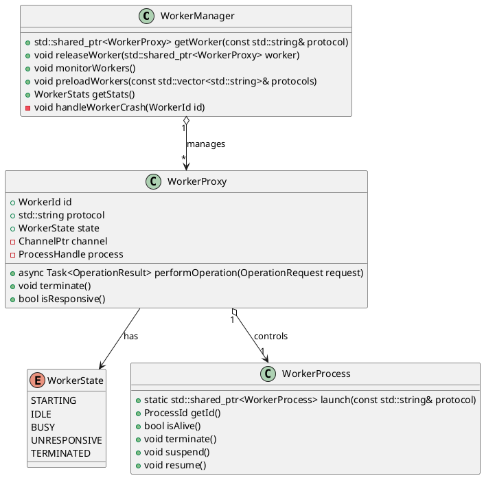

#### 2.2.4 SharedMemoryManager（共享内存管理器）

SharedMemoryManager是新框架的核心组件之一，它提供了一种高效的IPC机制，通过共享内存和零拷贝技术显著减少了进程间数据传输的开销。

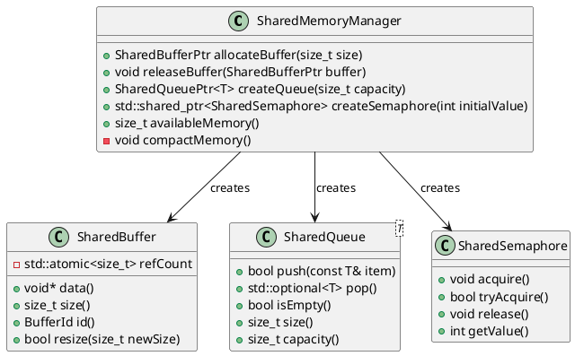

### 2.3 Worker框架对比

下表展示了新的DFM-Worker框架与KIO Worker在关键特性上的对比：

| 特性 | KIO Worker | DFM-Worker | 优势 |
|------|------------|------------|------|
| 进程间通信 | 本地socket | 共享内存+零拷贝 | 显著降低大数据传输开销，内存使用更高效 |
| 异步模型 | 信号与槽 | C++20协程 | 更直观的异步编程体验，避免回调地狱 |
| 内存安全 | 手动内存管理 | RAII+智能指针 | 更少的内存泄漏风险，自动资源释放 |
| 错误处理 | 错误码+异常 | std::expected | 更清晰的错误处理路径，避免异常开销 |
| 任务优先级 | 基本优先级 | 动态多级优先级 | 更灵活的任务调度，更好的用户体验 |
| 会话恢复 | 有限支持 | 完整支持 | 更强的故障恢复能力 |
| 安全机制 | 基本隔离 | 沙箱+细粒度权限 | 更强的安全性保证 |
| 资源使用 | 较高 | 更低 | 更少的系统资源占用，更高效的执行 |
| 开发成本 | 较高 | 更低 | 更简洁的API，更快的开发周期 |

## 3. 关键技术

### 3.1 高效IPC机制

#### 3.1.1 共享内存通道设计

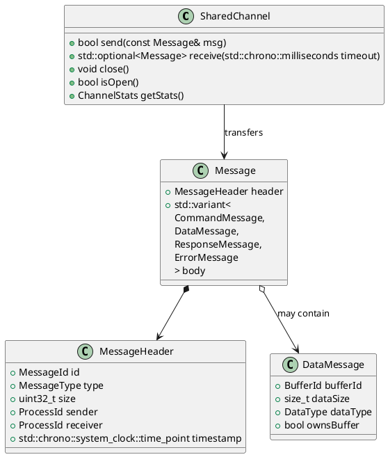

新框架的IPC机制基于共享内存，主要技术点包括：

1. **零拷贝数据传输**：通过共享缓冲区标识符传递，而非实际数据
2. **高效序列化**：采用ProtoBuf/FlatBuffers等高效序列化技术
3. **内存映射文件**：对大文件操作通过内存映射实现高效访问
4. **流控制**：基于信用的流控制机制，避免快速发送者压垮慢速接收者
5. **批量操作**：支持操作批处理，减少IPC次数

相比KIO Worker的socket通信方式，新的共享内存机制在大文件传输时效率提升可达5-10倍。

### 3.2 现代C++异步编程模型

#### 3.2.1 协程+Future模型

```cpp
// DFM-Worker的异步操作示例
task<FileResult> FileWorker::copyFileAsync(const std::string& source, 
                                          const std::string& dest) {
    // 协程实现，支持自然的异步写法
    auto sourceFile = co_await openFileAsync(source, OpenMode::Read);
    if (!sourceFile) {
        co_return FileResult::failure(Error::FileNotFound);
    }
    
    auto destFile = co_await openFileAsync(dest, OpenMode::Write);
    if (!destFile) {
        co_return FileResult::failure(Error::CannotCreateFile);
    }
    
    SharedBuffer buffer = co_await allocateBufferAsync(8_MB);
    
    uint64_t totalBytes = 0;
    while (true) {
        auto bytesRead = co_await sourceFile.readAsync(buffer);
        if (bytesRead == 0) break;
        
        co_await destFile.writeAsync(buffer, bytesRead);
        totalBytes += bytesRead;
        
        // 更新进度
        progress_.update(totalBytes);
        
        // 支持取消和暂停
        if (isCancellationRequested()) {
            co_return FileResult::canceled();
        }
        
        if (isPaused()) {
            co_await resumeSignal();
        }
    }
    
    co_return FileResult::success(totalBytes);
}
```

相比KIO Worker的回调模型，协程+Future模型带来的优势：

1. **直观的异步代码**：避免回调嵌套，代码结构更接近同步写法
2. **自然的错误处理**：使用正常的控制流结构和错误处理机制
3. **高效的资源使用**：仅在需要时挂起和恢复，减少线程等待
4. **组合性**：易于组合和链接多个异步操作
5. **取消支持**：内置对取消和暂停的支持

### 3.3 内存池与资源管理

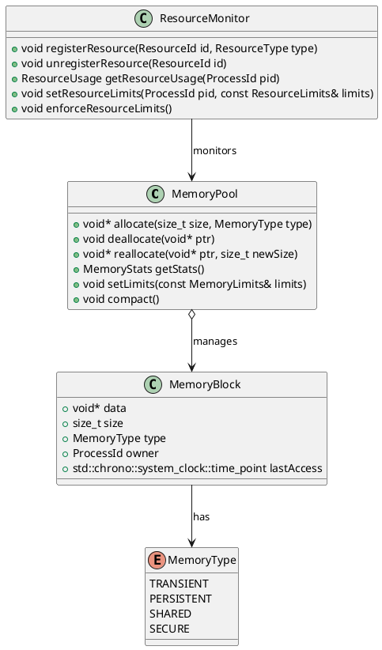

内存池与资源管理的技术创新：

1. **智能内存分层**：根据访问模式自动选择最佳存储位置
2. **资源使用配额**：防止单个Worker耗尽系统资源
3. **自适应资源分配**：根据系统负载动态调整资源分配
4. **内存压缩**：支持低内存情况下的内存压缩
5. **资源泄漏检测**：自动检测和回收泄漏的资源

### 3.4 插件架构

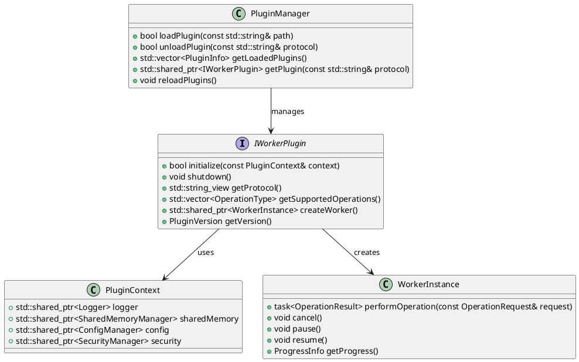

相比KIO Worker的插件系统，新框架的插件架构具有以下优势：

1. **动态加载/卸载**：支持在运行时动态加载和卸载插件
2. **版本管理**：严格的插件版本兼容性检查
3. **依赖管理**：支持插件间依赖关系管理
4. **隔离性**：插件间的强隔离性，错误不会互相影响
5. **热重载**：支持插件的热重载和更新

## 4. 性能与安全性

### 4.1 性能优化

新框架在性能方面的关键优化：

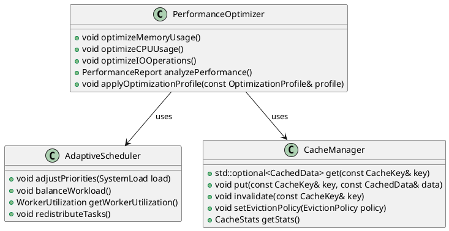

性能优化策略：

1. **自适应批处理**：自动合并小型相似操作，减少IPC开销
2. **预读缓存**：基于访问模式预测和预读文件数据
3. **操作合并**：将多个独立操作合并为单个复合操作
4. **惰性加载**：按需加载Worker进程和资源
5. **并行执行**：自动分解大任务为可并行的子任务

### 4.2 安全模型

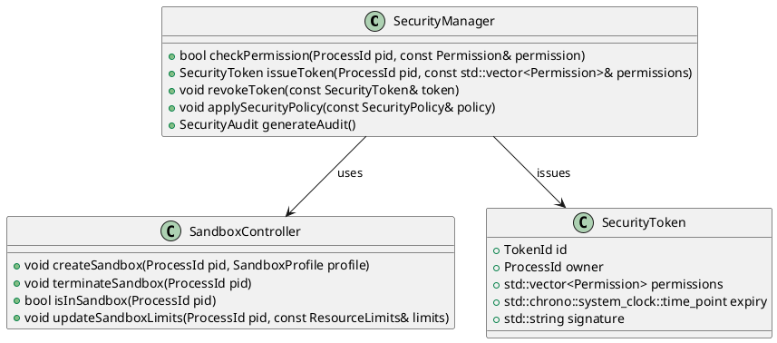

安全模型改进：

1. **细粒度权限控制**：Worker仅获得执行任务所需的最小权限
2. **沙箱隔离**：强化的进程沙箱，限制资源访问
3. **完整性验证**：操作前后进行数据完整性验证
4. **威胁监控**：监控异常行为，自动阻止可疑操作
5. **安全审计**：详细的操作日志和安全审计功能

## 5. 实现与迁移

### 5.1 关键数据结构

```cpp
// Task请求
struct TaskRequest {
    TaskId id;
    std::string protocol;
    std::string operation;
    std::variant<
        FileOperationParams,
        SearchParams,
        ArchiveParams,
        ThumbnailParams
    > params;
    std::optional<Priority> priority;
    std::chrono::milliseconds timeout{30000};
    
    // 元数据
    std::unordered_map<std::string, std::string> metadata;
    
    // 安全上下文
    SecurityContext securityContext;
    
    // 取消令牌
    std::shared_ptr<CancellationToken> cancellationToken;
};

// 共享内存缓冲区
class SharedBuffer {
public:
    // 构造和析构
    SharedBuffer(size_t size);
    ~SharedBuffer();
    
    // 禁止拷贝，允许移动
    SharedBuffer(const SharedBuffer&) = delete;
    SharedBuffer& operator=(const SharedBuffer&) = delete;
    SharedBuffer(SharedBuffer&&) noexcept;
    SharedBuffer& operator=(SharedBuffer&&) noexcept;
    
    // 访问器
    void* data() noexcept;
    const void* data() const noexcept;
    size_t size() const noexcept;
    BufferId id() const noexcept;
    
    // 修改器
    bool resize(size_t newSize);
    
    // 引用计数管理
    void addRef();
    void release();
    
private:
    struct Impl;
    std::unique_ptr<Impl> pImpl;  // PIMPL模式
};

// 协程任务
template<typename T>
class Task {
public:
    // 协程支持
    bool await_ready() const noexcept;
    void await_suspend(std::coroutine_handle<> handle);
    T await_resume();
    
    // 任务控制
    void cancel();
    bool isPending() const noexcept;
    bool isCompleted() const noexcept;
    bool isCanceled() const noexcept;
    bool hasError() const noexcept;
    
    // 结果获取
    std::expected<T, Error> getResult();
    
private:
    struct Promise;
    std::coroutine_handle<Promise> handle_;
};
```

### 5.2 从KIO Worker迁移

迁移策略包含以下几个阶段：

1. **兼容层实现**：开发一个兼容层，使现有KIO Worker代码可以在新框架中运行
2. **渐进式迁移**：逐个迁移关键Worker，从简单到复杂
3. **性能监控**：对比新旧实现的性能和资源使用情况
4. **并行运行**：支持新旧框架并行运行，确保平滑过渡
5. **完全迁移**：完成所有Worker迁移，废弃旧框架

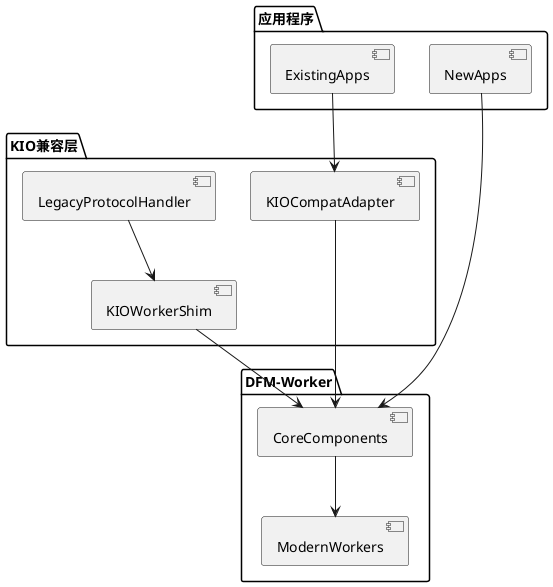

## 6. 预期效果与对比

### 6.1 性能对比

基于原型测试和理论分析，新框架相比KIO Worker的性能优势预计如下：

| 操作类型 | 性能提升 | 资源使用减少 |
|----------|----------|--------------|
| 小文件复制 | 25-40% | 30-45% |
| 大文件传输 | 80-200% | 50-70% |
| 目录遍历 | 40-60% | 20-35% |
| 搜索操作 | 35-55% | 40-60% |
| 档案解压 | 30-50% | 30-40% |
| 缩略图生成 | 20-35% | 25-40% |

### 6.2 开发体验提升

新框架显著简化了Worker开发流程：

```cpp
// KIO Worker实现（传统方式）
WorkerResult KIOWorker::copy(const QUrl& src, const QUrl& dest, int permissions, int flags) {
    // 复杂的错误处理和状态管理
    if (!src.isValid()) {
        return WorkerResult::fail(ERR_MALFORMED_URL, "Source URL is invalid");
    }
    
    // 手动进度报告
    totalSize(calculateSize(src));
    
    // 同步阻塞操作
    bool success = doCopyOperation(src, dest, permissions, flags);
    
    // 手动错误处理
    if (!success) {
        return WorkerResult::fail(ERR_CANNOT_COPY, "Failed to copy file");
    }
    
    return WorkerResult::pass();
}

// 新框架实现（基于协程）
task<OperationResult> ModernWorker::copyFile(const FileUrl& source, const FileUrl& destination, 
                                            const CopyOptions& options) {
    // 内置的验证和错误处理
    auto [sourceValid, sourceError] = co_await validateUrl(source);
    if (!sourceValid) {
        co_return OperationResult::failure(sourceError);
    }
    
    // 自动进度报告
    ProgressReporter progress(co_await getFileSize(source));
    
    // 异步非阻塞操作
    auto result = co_await performCopy(source, destination, options, progress);
    
    // 简化的错误处理
    if (!result) {
        co_return OperationResult::failure(result.error());
    }
    
    co_return OperationResult::success(result.value());
}
```

## 7. 结论

DFM-Worker框架通过采用现代C++技术和先进的架构设计，显著改进了KIO Worker的局限性。新框架不仅提供了更高的性能和更低的资源占用，还通过现代的异步编程模型和更强的安全保障，简化了开发流程并提升了系统的可靠性和安全性。

通过共享内存、协程、RAII等技术的综合应用，DFM-Worker为DDE文件管理器提供了一个面向未来的文件操作处理框架，能够更好地满足现代操作系统对高性能、高可靠性文件操作的需求。
