# DDE文件管理器Worker机制技术设计文档

## 1. 概述

DDE文件管理器Worker机制（util-dfm）是一个用于文件操作的分布式处理框架，它采用了worker进程模型来提高系统的可靠性、安全性和性能。通过将文件操作任务委托给专用的worker进程执行，可以有效隔离潜在的风险，并支持并行处理多个文件操作请求。

### 1.1 设计目标

- **高可靠性**：单个worker失败不会影响整个系统
- **安全隔离**：敏感操作在独立进程中执行，降低主程序风险
- **高性能**：支持并行执行多个文件操作
- **可扩展性**：易于添加新的worker类型，支持不同的文件操作
- **资源效率**：通过worker池机制复用进程资源
- **跨平台支持**：支持多种操作系统平台

### 1.2 系统架构概览

Worker机制由以下核心组件组成：

- **Core模块**：核心框架，包含调度器、连接管理和抽象接口
- **Worker进程**：执行具体文件操作的独立进程
- **Workers插件**：提供特定功能的worker实现库
- **Job管理**：客户端任务对象，管理任务状态和结果

## 2. 整体设计

### 2.1 静态模块结构

#### 2.1.1 核心类图

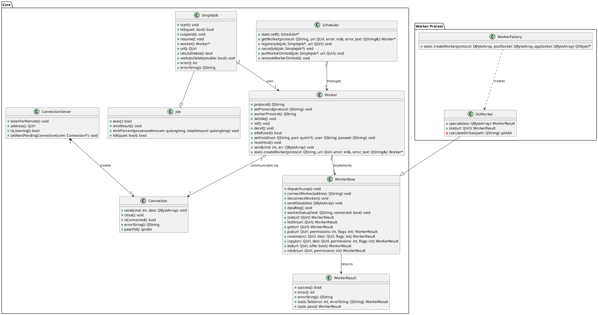

#### 2.1.2 包图

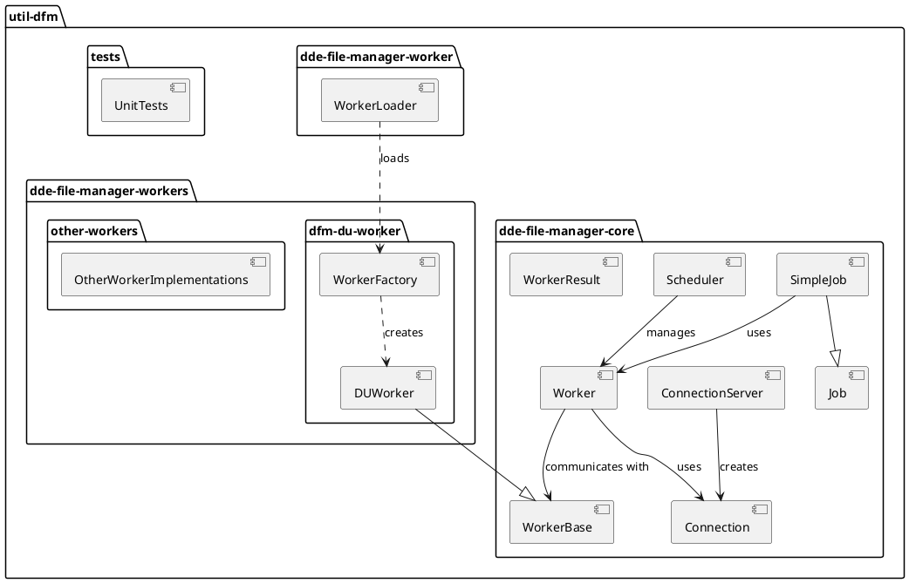

#### 2.1.3 部署图

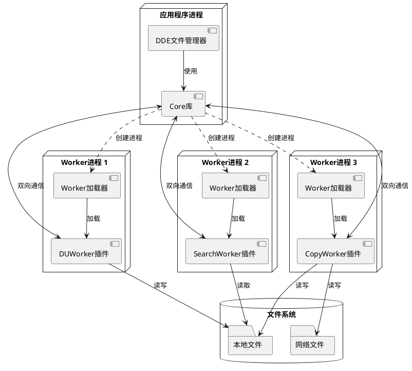

### 2.2 动态流程

#### 2.2.1 Worker创建与任务分配序列图

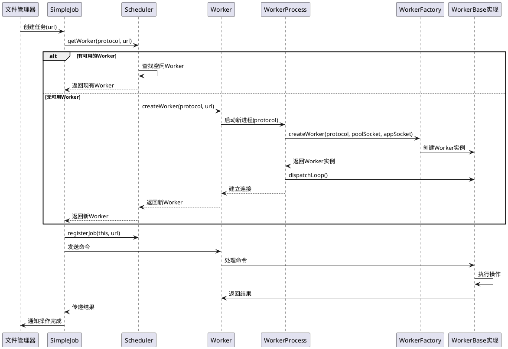

#### 2.2.2 Worker状态图

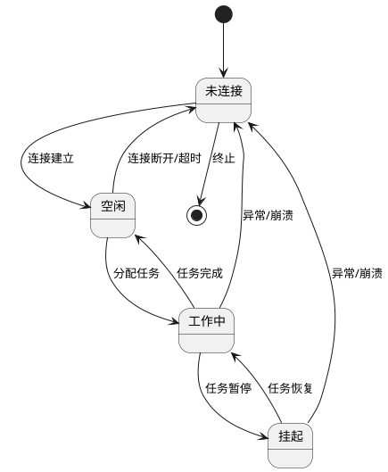

#### 2.2.3 任务处理协作图

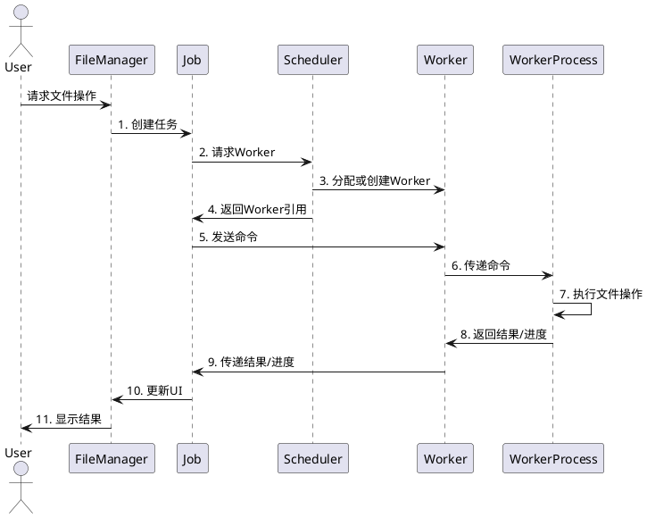

#### 2.2.4 Worker池管理泳道图

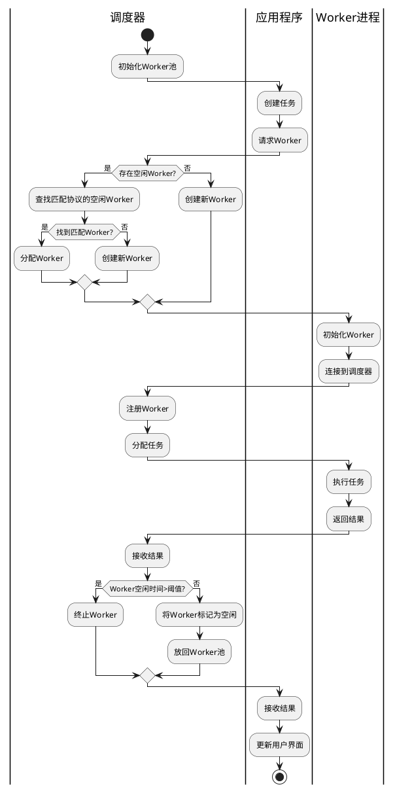

## 3. 关键技术

### 3.1 Worker进程管理

#### 3.1.1 Worker创建与生命周期管理

Worker进程管理是系统的核心技术之一，它涉及到进程的创建、通信、调度和资源管理。

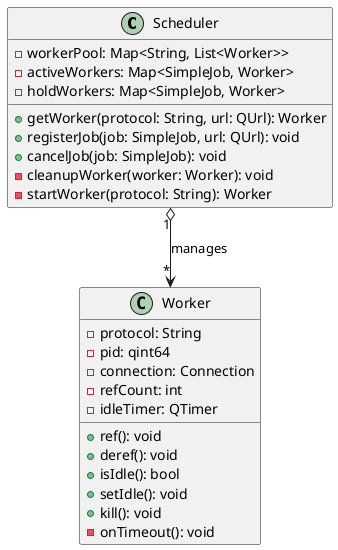

Worker进程的创建流程：

1. 调度器根据请求的协议类型确定需要启动的Worker类型
2. 使用QProcess启动Worker加载器进程，并传入Worker库路径、协议和通信socket
3. Worker加载器加载对应的Worker插件库
4. Worker实例化并连接到应用程序
5. 调度器注册Worker并分配任务

Worker生命周期状态转换：

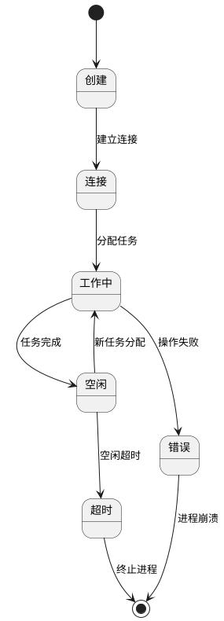

### 3.2 IPC通信机制

#### 3.2.1 应用程序与Worker间的通信

Worker机制采用socket进行进程间通信，支持高效的双向数据传输。

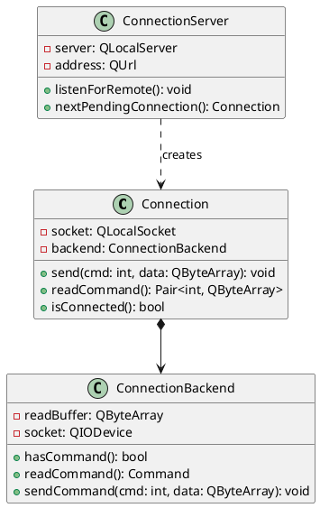

通信协议设计：

- 命令格式：`[命令ID(4字节)][数据长度(4字节)][数据内容(变长)]`
- 支持双向异步通信，既可以发送命令也可以发送响应
- 支持流式数据传输，适用于大文件处理

### 3.3 插件化Worker实现

#### 3.3.1 Worker插件接口设计

Worker采用插件化设计，可以轻松扩展新的Worker类型：

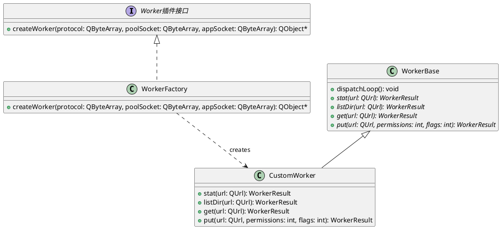

插件加载流程：

1. Worker加载器通过命令行参数接收Worker库路径
2. 使用QLibrary动态加载Worker库
3. 解析`kdemain`入口点函数
4. 创建WorkerFactory实例
5. 通过WorkerFactory创建具体的Worker实例

### 3.4 任务调度与执行

#### 3.4.1 调度算法与任务分配

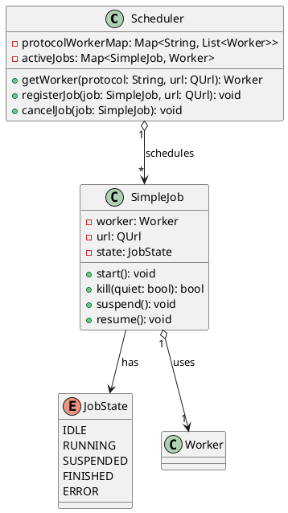

调度算法设计：

1. **Worker池复用**：
   - 按协议类型维护Worker池，优先复用空闲Worker
   - 当无可用Worker时创建新Worker
   - 空闲Worker超时自动清理，避免资源浪费

2. **任务优先级**：
   - 支持任务优先级设置，高优先级任务优先调度
   - 可中断低优先级任务给高优先级任务让路

3. **负载均衡**：
   - 限制每种类型Worker的最大数量，避免资源耗尽
   - 监控Worker负载情况，避免单个Worker过载

## 4. 性能与稳定性优化

### 4.1 性能优化分析

#### 4.1.1 Worker池资源使用分析

Worker池管理的时间复杂度分析：

- **Worker查找**：O(1) - 哈希表查找特定协议的Worker列表
- **空闲Worker分配**：O(n) - n为特定协议的Worker数量，通常较小
- **Worker注册**：O(1) - 哈希表插入操作
- **Worker清理**：O(1) - 哈希表删除操作

空间复杂度：
- 每个Worker进程占用约10-20MB内存
- 系统默认限制最大Worker数为协议类型数 × 5

内存使用优化：
```
Total Memory Usage = Base Memory + Number of Workers × Per-Worker Memory
```

其中：
- Base Memory: 约50MB (核心组件)
- Per-Worker Memory: 约15MB (每个Worker进程)
- Number of Workers: 动态变化，由调度算法控制

### 4.2 并发控制

#### 4.2.1 并发操作冲突处理

Worker机制采用以下策略避免并发操作冲突：

1. **文件锁定机制**：
   - 读操作允许共享访问
   - 写操作需要独占锁
   - 锁定粒度为单个文件或目录

2. **死锁预防**：
   - 资源分级分配策略
   - 超时机制自动释放长时间未使用的锁
   - 检测到潜在死锁时回滚操作

并发性能模型：
```
Throughput = Number of Workers × Operations Per Worker / Average Operation Time
```

其中：
- Number of Workers: Worker数量
- Operations Per Worker: 每个Worker单位时间内可处理的操作数
- Average Operation Time: 平均操作时间

### 4.3 错误处理与故障恢复

#### 4.3.1 Worker崩溃恢复机制

Worker崩溃检测与恢复流程：

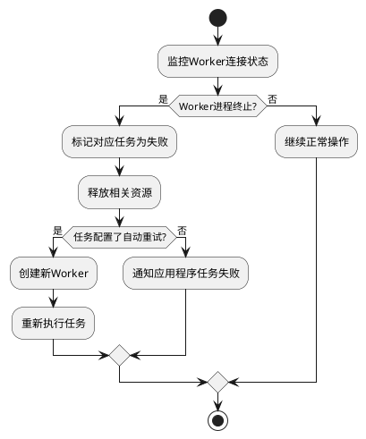

错误处理策略：

1. **分级错误处理**：
   - 非致命错误：Worker内部处理，返回错误码
   - 致命错误：Worker进程终止，应用程序处理

2. **故障隔离**：
   - 单个Worker崩溃不影响其他Worker
   - 应用程序可继续使用其他Worker正常工作

3. **恢复策略**：
   - 任务重试机制，自动重启失败的操作
   - 增量操作支持，从断点继续而非重新开始

## 5. 扩展性设计

### 5.1 新Worker类型添加

添加新Worker类型的步骤：

1. 创建新的Worker插件项目
2. 实现WorkerBase接口中的相关方法
3. 创建WorkerFactory类，实现createWorker函数
4. 导出C函数作为入口点
5. 编译为动态库
6. 注册新协议到系统中

### 5.2 版本兼容性

Worker框架设计了版本兼容机制：

- 协议版本号检查，确保Worker与Core版本兼容
- 向后兼容的API设计，新版本支持旧版本的Worker
- 优雅降级策略，当遇到不支持的功能时回退到基本功能

## 6. 安全性设计

### 6.1 进程隔离

Worker机制通过进程隔离实现安全性提升：

- Worker进程以最小权限运行
- 权限检查在操作执行前进行
- 沙箱技术限制Worker进程的系统资源访问

### 6.2 输入验证

所有来自客户端的输入在Worker处理前进行严格验证：

- URL安全性检查
- 路径遍历检测
- 特殊字符过滤
- 数据长度限制

## 7. 结论

DDE文件管理器Worker机制提供了一个高性能、高可靠性和可扩展的文件操作框架。通过进程隔离、插件化设计和调度优化，系统能够安全高效地处理各种文件操作请求，同时具备良好的错误恢复能力和扩展性。未来的开发方向包括更多类型Worker的支持、性能进一步优化以及更强大的分布式处理能力。
